# hey, i'm connor 👋

cs @ uwaterloo · toronto · [connor-tan.me](https://connor-tan.me)

<!--STATS:START-->
⌨️ **10-word pb:** 238 wpm &nbsp;·&nbsp; 🎧 **last played:**  [Wok — iluvmyzelf](https://open.spotify.com/track/1NpdCw5BNKqY3uIMJWO0eo)
<!--STATS:END-->

---

<picture>
<source media="(prefers-color-scheme: dark)" srcset="assets/graph-dark.svg">

</picture>

## 🧰 skills

languages

frameworks

databases & cloud

![azure](https://img.shields.io/badge/azure-0078D4?style=flat-square&logo=data%3Aimage%2Fsvg%2Bxml%3Bbase64%2CPHN2ZyB2aWV3Qm94PSIwIDAgMTI4IDEyOCIgeG1sbnM9Imh0dHA6Ly93d3cudzMub3JnLzIwMDAvc3ZnIj48ZGVmcz48bGluZWFyR3JhZGllbnQgaWQ9ImF6dXJlLW9yaWdpbmFsLWEiIHgxPSI2MC45MTkiIHkxPSI5LjYwMiIgeDI9IjE4LjY2NyIgeTI9IjEzNC40MjMiIGdyYWRpZW50VW5pdHM9InVzZXJTcGFjZU9uVXNlIj48c3RvcCBzdG9wLWNvbG9yPSIjMTE0QThCIi8%2BPHN0b3Agb2Zmc2V0PSIxIiBzdG9wLWNvbG9yPSIjMDY2OUJDIi8%2BPC9saW5lYXJHcmFkaWVudD48bGluZWFyR3JhZGllbnQgaWQ9ImF6dXJlLW9yaWdpbmFsLWIiIHgxPSI3NC4xMTciIHkxPSI2Ny43NzIiIHgyPSI2NC4zNDQiIHkyPSI3MS4wNzYiIGdyYWRpZW50VW5pdHM9InVzZXJTcGFjZU9uVXNlIj48c3RvcCBzdG9wLW9wYWNpdHk9Ii4zIi8%2BPHN0b3Agb2Zmc2V0PSIuMDcxIiBzdG9wLW9wYWNpdHk9Ii4yIi8%2BPHN0b3Agb2Zmc2V0PSIuMzIxIiBzdG9wLW9wYWNpdHk9Ii4xIi8%2BPHN0b3Agb2Zmc2V0PSIuNjIzIiBzdG9wLW9wYWNpdHk9Ii4wNSIvPjxzdG9wIG9mZnNldD0iMSIgc3RvcC1vcGFjaXR5PSIwIi8%2BPC9saW5lYXJHcmFkaWVudD48bGluZWFyR3JhZGllbnQgaWQ9ImF6dXJlLW9yaWdpbmFsLWMiIHgxPSI2OC43NDIiIHkxPSI1Ljk2MSIgeDI9IjExNS4xMjIiIHkyPSIxMjkuNTI1IiBncmFkaWVudFVuaXRzPSJ1c2VyU3BhY2VPblVzZSI%2BPHN0b3Agc3RvcC1jb2xvcj0iIzNDQ0JGNCIvPjxzdG9wIG9mZnNldD0iMSIgc3RvcC1jb2xvcj0iIzI4OTJERiIvPjwvbGluZWFyR3JhZGllbnQ%2BPC9kZWZzPjxwYXRoIGQ9Ik00Ni4wOS4wMDJoNDAuNjg1TDQ0LjU0MSAxMjUuMTM3YTYuNDg1IDYuNDg1IDAgMDEtNi4xNDYgNC40MTNINi43MzNhNi40ODIgNi40ODIgMCAwMS01LjI2Mi0yLjY5OSA2LjQ3NCA2LjQ3NCAwIDAxLS44NzYtNS44NDhMMzkuOTQ0IDQuNDE0QTYuNDg4IDYuNDg4IDAgMDE0Ni4wOSAweiIgZmlsbD0idXJsKCNhenVyZS1vcmlnaW5hbC1hKSIgdHJhbnNmb3JtPSJ0cmFuc2xhdGUoLjU4NyA0LjQ2OCkgc2NhbGUoLjkxOTA0KSIvPjxwYXRoIGQ9Ik05Ny4yOCA4MS42MDdIMzcuOTg3YTIuNzQzIDIuNzQzIDAgMDAtMS44NzQgNC43NTFsMzguMSAzNS41NjJhNS45OTEgNS45OTEgMCAwMDQuMDg3IDEuNjFoMzMuNTc0eiIgZmlsbD0iIzAwNzhkNCIvPjxwYXRoIGQ9Ik00Ni4wOS4wMDJBNi40MzQgNi40MzQgMCAwMDM5LjkzIDQuNUwuNjQ0IDEyMC44OTdhNi40NjkgNi40NjkgMCAwMDYuMTA2IDguNjUzaDMyLjQ4YTYuOTQyIDYuOTQyIDAgMDA1LjMyOC00LjUzMWw3LjgzNC0yMy4wODkgMjcuOTg1IDI2LjEwMWE2LjYxOCA2LjYxOCAwIDAwNC4xNjUgMS41MTloMzYuMzk2bC0xNS45NjMtNDUuNjE2LTQ2LjUzMy4wMTFMODYuOTIyLjAwMnoiIGZpbGw9InVybCgjYXp1cmUtb3JpZ2luYWwtYikiIHRyYW5zZm9ybT0idHJhbnNsYXRlKC41ODcgNC40NjgpIHNjYWxlKC45MTkwNCkiLz48cGF0aCBkPSJNOTguMDU1IDQuNDA4QTYuNDc2IDYuNDc2IDAgMDA5MS45MTcuMDAySDQ2LjU3NWE2LjQ3OCA2LjQ3OCAwIDAxNi4xMzcgNC40MDZsMzkuMzUgMTE2LjU5NGE2LjQ3NiA2LjQ3NiAwIDAxLTYuMTM3IDguNTVoNDUuMzQ0YTYuNDggNi40OCAwIDAwNi4xMzYtOC41NXoiIGZpbGw9InVybCgjYXp1cmUtb3JpZ2luYWwtYykiIHRyYW5zZm9ybT0idHJhbnNsYXRlKC41ODcgNC40NjgpIHNjYWxlKC45MTkwNCkiLz48L3N2Zz4K&logoColor=white)

tools

![visual studio](https://img.shields.io/badge/visual%20studio-5C2D91?style=flat-square&logo=data%3Aimage%2Fsvg%2Bxml%3Bbase64%2CPHN2ZyB4bWxucz0iaHR0cDovL3d3dy53My5vcmcvMjAwMC9zdmciIHZpZXdCb3g9IjAgMCAxMjggMTI4Ij48cGF0aCBmaWxsPSIjNTIyMThhIiBkPSJNOTQuMTQ1LjM0OGE4IDggMCAwIDAtLjU2My4wNzIgOCA4IDAgMCAwLS45MjguMDI3IDggOCAwIDAgMC0uOTgyLjIxNSA4IDggMCAwIDAtLjU1My4wNzIgOCA4IDAgMCAwLS44MjIuMzg3IDggOCAwIDAgMC0uNDg2LjIyOUE4IDggMCAwIDAgODggMi42NjhMNDUuNDg2IDQ5LjY3NGwtMjQuODItMjAuMzQtMi4xNzItMS44NjVhNS4zMzMgNS4zMzMgMCAwIDAtLjgyNi0uNDYzIDUuMzMzIDUuMzMzIDAgMCAwLS41MzUtLjMgNS4zMzMgNS4zMzMgMCAwIDAtLjYwNC0uMjI3IDUuMzMzIDUuMzMzIDAgMCAwLS42NDQtLjE1IDUuMzMzIDUuMzMzIDAgMCAwLS41MDQtLjAxNyA1LjMzMyA1LjMzMyAwIDAgMC0uNTEtLjA3NCA1LjMzMyA1LjMzMyAwIDAgMC0uMjY2LjA2IDUuMzMzIDUuMzMzIDAgMCAwLS4yMTQtLjAwMyA1LjMzMyA1LjMzMyAwIDAgMC0uMjI3LjA2IDUuMzMzIDUuMzMzIDAgMCAwLS40ODQuMDA2IDMuNCAzLjQgMCAwIDAtLjcwNy4yNGwtOS42OTQgNC4wNjdhNS4zMzMgNS4zMzMgMCAwIDAtMS40NjYuOTUgNS4zMzMgNS4zMzMgMCAwIDAtLjIxNS4xNzcgNS4zMzMgNS4zMzMgMCAwIDAtLjIzLjMxMiA1LjMzMyA1LjMzMyAwIDAgMC0uNjQuODggNS4zMzMgNS4zMzMgMCAwIDAtLjI2Ny40NzYgNS4zMzMgNS4zMzMgMCAwIDAtLjA5LjI3NSA1LjMzMyA1LjMzMyAwIDAgMC0uMjMyLjkwOCA1LjMzMyA1LjMzMyAwIDAgMC0uMTM5LjUxNnY1Ny42OGE1LjMzMyA1LjMzMyAwIDAgMCAuMTM5LjUxMiA1LjMzMyA1LjMzMyAwIDAgMCAuMjMyLjkxNCA1LjMzMyA1LjMzMyAwIDAgMCAuMDkuMjcxIDUuMzMzIDUuMzMzIDAgMCAwIC4yNjguNDc3IDUuMzMzIDUuMzMzIDAgMCAwIC42MzguODc5IDUuMzMzIDUuMzMzIDAgMCAwIC4yMy4zMTIgNS4zMzMgNS4zMzMgMCAwIDAgLjIxNi4xNzggNS4zMzMgNS4zMzMgMCAwIDAgMS40NjYuOTQ5bDkuNjk0IDQuMDY2YTUuMzMzIDUuMzMzIDAgMCAwIDEuNzE2LjM3IDUuMzMzIDUuMzMzIDAgMCAwIC41MS0uMDEgNS4zMzMgNS4zMzMgMCAwIDAgMS4yNzItLjE5OCA1LjMzMyA1LjMzMyAwIDAgMCAuNTEtLjE1NCA1LjMzMyA1LjMzMyAwIDAgMCAxLjUxMy0uODczbDIuMTcyLTEuODY3IDI0LjgyLTIwLjM0TDg4IDEyNS4zMzRhOCA4IDAgMCAwIDEuOTAyIDEuMzg3IDggOCAwIDAgMCAuNjA0LjIzIDggOCAwIDAgMCAuMDA2LjAwMiA4IDggMCAwIDAgMS4zNDIuNTE2IDggOCAwIDAgMCAuMjQyLjAxMyA4IDggMCAwIDAgMS41NTguMDg4IDggOCAwIDAgMCAuOTkuMDE0IDggOCAwIDAgMCAyLjQ1LS43MDNsMjYuMzczLTEyLjY4YTggOCAwIDAgMCAuNTcyLS4zMDYgOCA4IDAgMCAwIC4xNy0uMTA2IDggOCAwIDAgMCAuMzgzLS4yNSA4IDggMCAwIDAgLjE4MS0uMTM1IDggOCAwIDAgMCAuMzMtLjI1OCA4IDggMCAwIDAgLjIwNC0uMTczIDggOCAwIDAgMCAuMjc3LS4yNiA4IDggMCAwIDAgLjE5LS4xOSA4IDggMCAwIDAgLjI4My0uMzE0IDggOCAwIDAgMCAuMTQ0LS4xNjYgOCA4IDAgMCAwIC4yNjYtLjM1MiA4IDggMCAwIDAgLjE0Mi0uMTkzIDggOCAwIDAgMCAuMzMtLjUzIDggOCAwIDAgMCAuMDktLjE3IDggOCAwIDAgMCAuMi0uMzg2IDggOCAwIDAgMCAuMTEzLS4yNTYgOCA4IDAgMCAwIC4xNTItLjM3OSA4IDggMCAwIDAgLjA3Ni0uMjE1IDggOCAwIDAgMCAuMTE2LS4zNjcgOCA4IDAgMCAwIC4wODItLjMwNCA4IDggMCAwIDAgLjA3Mi0uMzQyIDggOCAwIDAgMCAuMDUzLS4yNzQgOCA4IDAgMCAwIC4wNTYtLjQzMSA4IDggMCAwIDAgLjAyMi0uMTggOCA4IDAgMCAwIC4wMDItLjAyMyA4IDggMCAwIDAgLjAyNy0uNjUzVjIxLjAyN2E4IDggMCAwIDAgMC0uMDExIDggOCAwIDAgMC0uMDI3LS42NTUgOCA4IDAgMCAwLS4wMTgtLjE1OCA4IDggMCAwIDAtLjA2Ni0uNTA4IDggOCAwIDAgMC0uMDM0LS4xNyA4IDggMCAwIDAtLjA5NS0uNDQzIDggOCAwIDAgMC0uMDczLS4yNjggOCA4IDAgMCAwLS4xMDMtLjMzIDggOCAwIDAgMC0uMTAyLS4yOTUgOCA4IDAgMCAwLS4xNDItLjM0NSA4IDggMCAwIDAtLjEtLjIzMyA4IDggMCAwIDAtLjIwOS0uNDA0IDggOCAwIDAgMC0uMTAzLS4xOTUgOCA4IDAgMCAwLS4zMzItLjUyOCA4IDggMCAwIDAtLjEwNi0uMTQgOCA4IDAgMCAwLS4yNzctLjM3IDggOCAwIDAgMC0uMTg4LS4yMTYgOCA4IDAgMCAwLS4yNDYtLjI3NCA4IDggMCAwIDAtLjE5My0uMTkzIDggOCAwIDAgMC0uMjgtLjI2MiA4IDggMCAwIDAtLjIwMi0uMTc0IDggOCAwIDAgMC0uMzMtLjI1NyA4IDggMCAwIDAtLjE4Mi0uMTM1IDggOCAwIDAgMC0uMzgzLS4yNSA4IDggMCAwIDAtLjE3LS4xMDYgOCA4IDAgMCAwLS41NzItLjMwNkw5Ny4wOTQgMS4xMkE4IDggMCAwIDAgOTQuNzUuNDE2YTggOCAwIDAgMC0uMzQyLjAwMiA4IDggMCAwIDAtLjI2My0uMDd6TTk2IDM2LjkwOHY1NC4xODZMNjIuOTQ3IDY0LjAwMiA5NiAzNi45MDh6bS04MCA4LjgyIDE2LjUyNyAxOC4yNzRMMTYgODIuMjc1VjQ1LjczeiIvPjwvc3ZnPgo%3D&logoColor=white)

## 🔴 connect four

<!--C4:START-->

🔴 **red moves next** — click a column number and press *create* to drop a disc.

<picture>
<source media="(prefers-color-scheme: dark)" srcset="assets/board-dark.svg?v=5">

</picture>

**Recent moves**

- 🟡 [@ConnorXTan](https://github.com/ConnorXTan) → column 4
- 🔴 [@AlanP70](https://github.com/AlanP70) → column 3
- 🟡 [@ConnorXTan](https://github.com/ConnorXTan) → column 4
- 🔴 [@ConnorXTan](https://github.com/ConnorXTan) → column 5
- 🟡 [@ConnorXTan](https://github.com/ConnorXTan) → column 3

🔴 wins: **0** · 🟡 wins: **0** · 🤝 draws: **0**

<!--C4:END-->

<!-- 🥚 easter egg 1/3 🥚 -->
