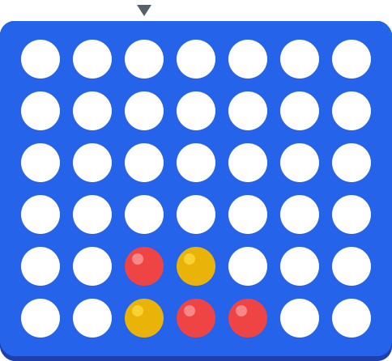

# hey, i'm connor 👋

cs @ uwaterloo · toronto · [connor-tan.me](https://connor-tan.me)

<!--STATS:START-->
⚙️ live stats warming up…
<!--STATS:END-->

---

## 🔴 community connect four

<!--C4:START-->

**Anyone with a GitHub account can play — it's one shared board.** 🔴 **Red moves next.**
Click a column number to drop a disc (it opens a pre-filled issue — just press *Create*):

<picture>
<source media="(prefers-color-scheme: dark)" srcset="assets/board-dark.svg">

</picture>

⬇️&nbsp;&nbsp;[**1**](https://github.com/ConnorXTan/ConnorXTan/issues/new?title=c4%7Cdrop%7C1&body=Just+press+%27Create%27+below+%E2%80%94+a+bot+will+drop+your+disc+in+column+1+and+update+the+board+in+~30+seconds.+%F0%9F%8E%AE) &nbsp; [**2**](https://github.com/ConnorXTan/ConnorXTan/issues/new?title=c4%7Cdrop%7C2&body=Just+press+%27Create%27+below+%E2%80%94+a+bot+will+drop+your+disc+in+column+2+and+update+the+board+in+~30+seconds.+%F0%9F%8E%AE) &nbsp; [**3**](https://github.com/ConnorXTan/ConnorXTan/issues/new?title=c4%7Cdrop%7C3&body=Just+press+%27Create%27+below+%E2%80%94+a+bot+will+drop+your+disc+in+column+3+and+update+the+board+in+~30+seconds.+%F0%9F%8E%AE) &nbsp; [**4**](https://github.com/ConnorXTan/ConnorXTan/issues/new?title=c4%7Cdrop%7C4&body=Just+press+%27Create%27+below+%E2%80%94+a+bot+will+drop+your+disc+in+column+4+and+update+the+board+in+~30+seconds.+%F0%9F%8E%AE) &nbsp; [**5**](https://github.com/ConnorXTan/ConnorXTan/issues/new?title=c4%7Cdrop%7C5&body=Just+press+%27Create%27+below+%E2%80%94+a+bot+will+drop+your+disc+in+column+5+and+update+the+board+in+~30+seconds.+%F0%9F%8E%AE) &nbsp; [**6**](https://github.com/ConnorXTan/ConnorXTan/issues/new?title=c4%7Cdrop%7C6&body=Just+press+%27Create%27+below+%E2%80%94+a+bot+will+drop+your+disc+in+column+6+and+update+the+board+in+~30+seconds.+%F0%9F%8E%AE) &nbsp; [**7**](https://github.com/ConnorXTan/ConnorXTan/issues/new?title=c4%7Cdrop%7C7&body=Just+press+%27Create%27+below+%E2%80%94+a+bot+will+drop+your+disc+in+column+7+and+update+the+board+in+~30+seconds.+%F0%9F%8E%AE)

**Recent moves**

*No moves yet this game — start it off!*

🏁 games played: **0** · 🔴 wins: **0** · 🟡 wins: **0** · 🤝 draws: **0** · This is the very first game — make history.

<!--C4:END-->

🤔 wait, how does a README play connect four?

 

Each column number is a link that opens a pre-filled GitHub issue. Opening it
triggers a [GitHub Action](.github/workflows/connect-four.yml) that runs a
[tiny game engine](scripts/connect_four.py), validates your move, re-renders
the board as SVG (light **and** dark mode), rewrites this README, commits it
all back, and closes your issue with the result — usually in under 30 seconds.

The [live stats](.github/workflows/update-stats.yml) up top work the same way,
on an hourly schedule.

<!-- 🕵️ reading the markdown source, are we? we should be friends → connor-tan.me -->
